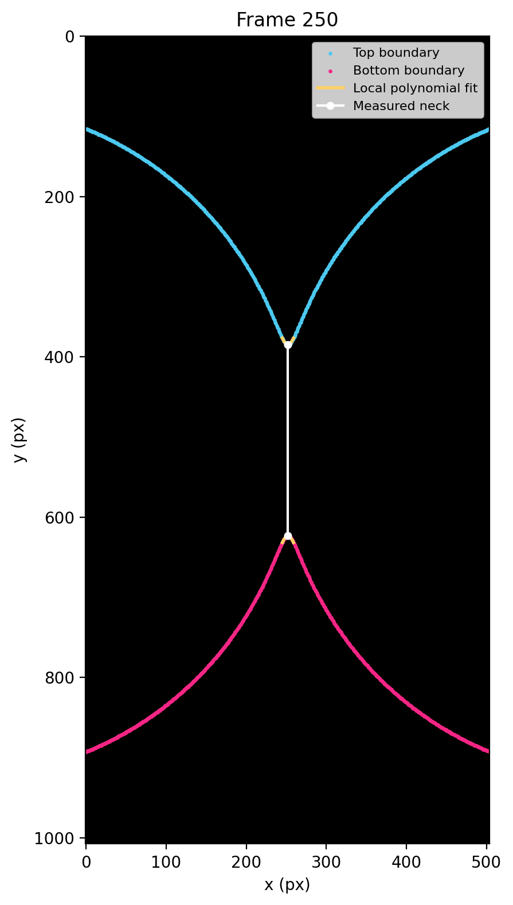
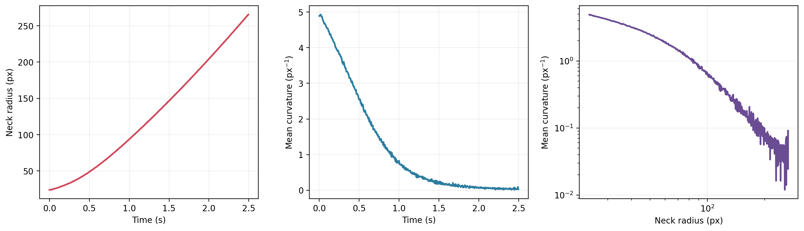

# Automated Curvature Extraction from High-Speed Coalescence Videos

This project converts a multi-frame TIFF stack into quantitative measurements
of bridge radius and local interface curvature. It presents an end-to-end
scientific Python workflow: streaming image ingestion, segmentation, feature
engineering, numerical fitting, analytical differentiation, validation, and
reproducible reporting.

The included 500-frame video is synthetic and safe to share publicly. No raw
experimental or publication data are included. Start with
[`notebooks/coalescence_curvature_analysis.ipynb`](notebooks/coalescence_curvature_analysis.ipynb)
for the complete, reproducible walkthrough.

This figure below shows an annotated experimental image of fluid-air interface, with relevant lengths labeled:


## What the pipeline does

For each frame, the pipeline:

1. Streams one image from the TIFF stack instead of loading the full video into memory.
2. Thresholds the bright interfaces against the dark background.
3. Collapses anti-aliased line thickness to one boundary location per x-coordinate.
4. Locates the upper and lower bridge extrema.
5. Fits fourth-order polynomials over configurable local windows.
6. Computes curvature from the analytical derivatives,

   \[
   \kappa = \frac{|y''|}{\left(1 + y'^2\right)^{3/2}}.
   \]

7. Exports frame-level measurements, diagnostic overlays, and summary plots.



## Verified results

The bundled synthetic TIFF contains 500 RGB frames at 1008 x 504 pixels. With
the default 200-fps metadata and a 96/255 intensity threshold, the verified run
produced:

| Metric | Result |
| --- | ---: |
| Frames analyzed | 500 |
| End-to-end runtime | 5.18 s |
| Processing throughput | 96.6 frames/s |
| Median local-fit RMSE | 0.169 px |
| Repeated per-point fit calls (100-frame benchmark) | 3,000 |
| Single-pass boundary fit calls | 200 |
| Fit-call reduction | 15.0x |
| Isolated fitting-stage speedup | 15.3x |

Runtime measurements are environment-specific. The benchmark isolates the
polynomial-fitting stage and compares repeated per-point fitting with the
single-pass boundary implementation.

## Performance optimization

A naive local-fitting loop can recompute the same polynomial once for every
point in a 15-point window. This pipeline performs one fit per boundary per
frame, preserving the numerical result while reducing fit calls by 15x in the
representative benchmark.

The implementation also:

- replaces hard-coded local paths with command-line arguments;
- centralizes frame rate, threshold, midpoint, fit degree, and window size;
- separates reusable analysis code from exploration and visualization;
- evaluates curvature at fitted extrema rather than mixing fitted and discrete coordinates;
- adds tests against the known curvature of a circle;
- uses descriptive function names and documented data structures; and
- keeps only one TIFF frame in memory at a time.

## Repository structure

```text
coalescence-curvature-analysis/
├── data/
│   └── michelle0912_sample.tif
├── notebooks/
│   └── coalescence_curvature_analysis.ipynb
├── results/
│   ├── analysis_summary.json
│   ├── benchmark.json
│   ├── curvature_measurements.csv
│   ├── curvature_summary.png
│   └── frame_diagnostic.png
├── scripts/
│   ├── analyze_video.py
│   └── benchmark_fitting.py
├── src/coalescence_curvature/
│   ├── __init__.py
│   └── analysis.py
├── tests/
│   └── test_analysis.py
├── pyproject.toml
└── requirements.txt
```

## Installation

Create a virtual environment and install the package:

```bash
python -m venv .venv
source .venv/bin/activate  # Windows: .venv\Scripts\activate
python -m pip install --upgrade pip
python -m pip install -e .
```

## Run the full analysis

```bash
python scripts/analyze_video.py data/michelle0912_sample.tif \
  --output-dir results \
  --fps 200 \
  --threshold 96 \
  --diagnostic-frame 250
```

Useful options include `--midpoint-y`, `--degree`, `--fit-half-width`, and
`--max-frames`. Run `python scripts/analyze_video.py --help` for the complete
interface.

## Reproduce the optimization benchmark

```bash
python scripts/benchmark_fitting.py data/michelle0912_sample.tif \
  --frames 100 \
  --repeats 5
```

## Run the tests

```bash
python -m unittest discover -s tests -v
```

The mathematical validation generates points from a circle of radius \(R\) and
checks that the extracted curvature agrees with the analytical value \(1/R\)
within 2%.

## Adapting the code to experimental data

The current segmentation assumes bright interfaces on a dark background. For a
new dataset, begin by adjusting:

- `threshold` for interface visibility;
- `midpoint_y` if the bridge is not vertically centered;
- `fit_half_width_px` for the local curvature scale; and
- `fps` for the acquisition rate.

For noisy or textured experimental images, a future extension could replace
the intensity threshold with edge detection or active-contour segmentation.

## Portfolio summary

> Built a memory-conscious Python image-analysis pipeline for 500-frame,
> high-speed TIFF stacks; extracted bridge geometry and curvature through local
> polynomial modeling, validated the method against analytical curvature, and
> optimized a repeated-fit bottleneck to reduce fitting operations by 15x.
